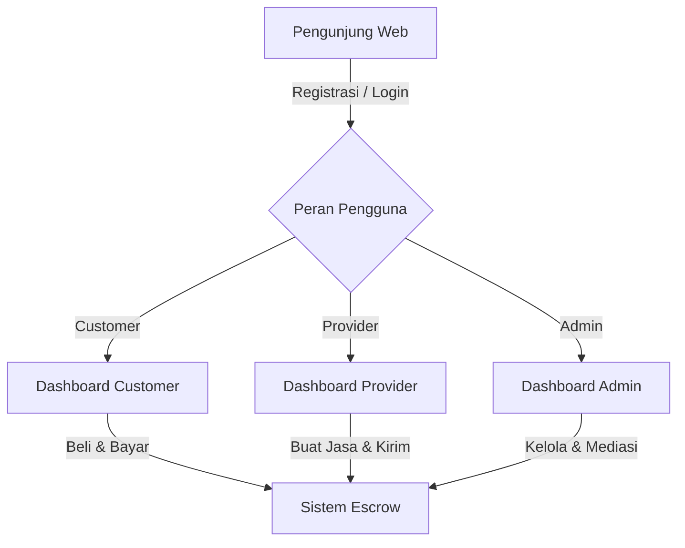

# Dokumentasi Lengkap & Arsitektur Fitur - ServeMix Marketplace

Selamat datang di dokumentasi teknis lengkap **ServeMix Marketplace**, sebuah platform marketplace jasa digital korporat premium (desain grafis, pembuatan konten, pemrograman, dll.) yang menghubungkan **Customer** (pembeli jasa) dengan **Provider** (penyedia jasa/freelancer) di bawah naungan sistem pengawasan **Admin** (pengelola platform).

Platform ini didesain dengan estetika modern **Dark Navy Glassmorphism** (menggunakan kombinasi warna biru gelap, overlay transparan kaca, border tipis, efek glow/shimmer lembut, dan pergerakan halus) yang memberikan kesan percaya diri, kredibel, dan sangat premium.

---

## DAFTAR ISI
1. [Arsitektur Peran Pengguna (Role Architecture)](#1-arsitektur-peran-pengguna-role-architecture)
2. [Sistem Keuangan & Alur Rekening Bersama (Escrow System)](#2-sistem-keuangan--alur-rekening-bersama-escrow-system)
3. [Integrasi Gerbang Pembayaran Midtrans (Midtrans Payment Gateway)](#3-integrasi-gerbang-pembayaran-midtrans-midtrans-payment-gateway)
4. [Siklus Hidup Pesanan (Order Lifecycle & Fulfillment)](#4-siklus-hidup-pesanan-order-lifecycle--fulfillment)
5. [Pusat Resolusi Sengketa (Dispute Resolution Center)](#5-pusat-resolusi-sengketa-dispute-resolution-center)
6. [Integrasi Kecerdasan Buatan (AI Copilot & CS Bot via Gemini API)](#6-integrasi-kecerdasan-buatan-ai-copilot--cs-bot-via-gemini-api)
7. [Sistem Pesan Instan & Custom Offers (Messaging System)](#7-sistem-pesan-instan--custom-offers-messaging-system)
8. [Sistem Keamanan File & Lampiran (Secure File System)](#8-sistem-keamanan-file--lampiran-secure-file-system)
9. [Dashboard Moderasi Admin & Laporan (Admin Moderation & Reporting)](#9-dashboard-moderasi-admin--laporan-admin-moderation--reporting)
10. [Struktur Skema Database Utama (Database Schema Overview)](#10-struktur-skema-database-utama-database-schema-overview)

---

## 1. Arsitektur Peran Pengguna (Role Architecture)

Platform ini mengadopsi struktur otorisasi multi-role yang membagi pengguna ke dalam tiga kategori utama dengan akses rute, fungsionalitas, dan view dashboard yang sepenuhnya terpisah:



### A. Peran Customer (Pembeli Jasa)
Customer bertindak sebagai pencari solusi digital. Fitur khusus mereka meliputi:
*   **Pencarian & Filtrasi Jasa**: Menjelajahi katalog layanan berdasarkan kategori, subkategori, tag, rating, dan rentang harga.
*   **Sistem Favorit (Wishlist)**: Menyimpan produk jasa yang menarik ke dalam daftar favorit menggunakan tabel pivot.
*   **Checkout & Pembayaran**: Memilih paket jasa (Basic, Standard, Premium), menerapkan kode voucher promo, dan melakukan pembayaran via saldo dompet digital (wallet) atau Midtrans.
*   **Penyerahan Requirements**: Mengisi formulir kebutuhan instruksi kerja serta melampirkan file aset pendukung sebelum pengerjaan dimulai.
*   **Kontrol Pesanan**: Menyetujui hasil pengiriman (Accept), meminta perbaikan (Request Revision) sesuai kuota paket, mengajukan sengketa (Dispute), atau membatalkan pesanan (Cancel) pada fase awal.
*   **Review & Rating**: Memberikan penilaian bintang (1-5) dan ulasan tekstual pada pesanan yang telah selesai.

### B. Peran Provider (Penyedia Jasa)
Provider adalah freelancer atau tim agensi yang menjual jasa mereka. Fitur khusus mereka meliputi:
*   **Multi-step Onboarding**: Alur pendaftaran terpandu untuk melengkapi profil (avatar, bio, detail keahlian, dan portofolio profesional) sebelum diizinkan membuat listing jasa.
*   **Manajemen Jasa (Service CRUD)**: Membuat katalog jasa dengan 3 tingkatan paket harga, mengupload gambar galeri, dan menetapkan estimasi waktu pengiriman serta jumlah revisi.
*   **AI Service Creator**: Asisten AI untuk membantu membuat copywriting judul, deskripsi layanan teroptimasi SEO, dan rekomendasi tag pencarian.
*   **Manajemen Pemenuhan (Order Fulfillment)**: Memantau deadline aktif, menyerahkan file hasil kerja (delivery file) beserta pesan penyerahan.
*   **Dompet Penghasilan & Penarikan (Withdrawal)**: Memantau saldo penghasilan bersih, mengajukan permintaan penarikan dana ke rekening bank lokal, dan melihat riwayat mutasi dana.

### C. Peran Admin (Pengelola Platform / CS)
Admin memiliki kekuasaan penuh atas jalannya ekosistem bisnis platform. Fitur khusus mereka meliputi:
*   **Dashboard Statistik**: Grafik pendapatan real-time, volume pesanan harian/bulanan, dan pendaftaran pengguna baru.
*   **Manajemen Pengguna (User Management)**: Melakukan blokir/ban pengguna yang melanggar aturan, mengaktifkan akun, atau mengubah detail akun.
*   **Kurasi Layanan (Service Moderation)**: Menyetujui atau menolak jasa baru yang diajukan oleh provider agar standar kualitas katalog tetap terjaga.
*   **Mediasi Sengketa (Dispute Resolution)**: Mengambil keputusan final atas dana escrow (refund ke pembeli atau cairkan ke penjual) pada pesanan yang disengketakan.
*   **Manajemen Tiket CS**: Menangani antrean percakapan bantuan yang ditransfer dari AI CS Bot ke Agen Manusia.
*   **Laporan PDF Finansial**: Mengekspor laporan ringkasan transaksi platform secara berkala dalam format PDF.

---

## 2. Sistem Keuangan & Alur Rekening Bersama (Escrow System)

Demi menjaga keamanan transaksi bagi kedua belah pihak, platform menggunakan **Sistem Rekening Bersama (Escrow)**. Uang yang dibayarkan oleh Customer tidak langsung masuk ke rekening/saldo Provider, melainkan ditahan sementara oleh sistem.

```
[Customer] --(Bayar Jasa + 10% Layanan)--> [Escrow (Sistem Ditahan)]
                                                     |
                                   (Ketika Pesanan Selesai / Disetujui)
                                                     v
                                [Dompet Provider] (Menerima 100% Harga Jasa)
                                [Kas Platform]    (Menerima 10% Biaya Layanan)
```

### Logika Keuangan & Perhitungan Biaya (Fee)
1.  **Biaya Layanan (Platform Service Fee / Tax)**: Ditetapkan sebesar **10% dari harga dasar paket** yang dibeli. Biaya ini dibebankan kepada **Customer** di atas harga jasa.
    *   *Contoh*: Jika harga jasa paket Basic adalah Rp100.000, maka Biaya Layanan adalah Rp10.000. Customer membayar total Rp110.000.
2.  **Penerimaan Provider**: Provider menerima **100% dari harga jasa** tanpa potongan tambahan saat pesanan diselesaikan (`completed`).
    *   *Contoh*: Provider menerima Rp100.000 penuh ke saldo dompet mereka.
3.  **Kas Platform**: Platform mengamankan Rp10.000 (biaya layanan) sebagai pendapatan bersih platform yang dicatat dalam log transaksi bertipe `fee`.

### Pembuatan Pesanan & Perhitungan Ledger (OrderService.php)
Proses pembuatan transaksi dilakukan secara transaksional database (`DB::transaction`) untuk menjamin konsistensi data keuangan:

```php
// Potongan kode logika pembuatan pesanan di OrderService.php
public function create(int $customerId, Service $service, ServicePackage $package, ?string $notes = null, ?Voucher $voucher = null): Order
{
    return DB::transaction(function () use ($customerId, $service, $package, $notes, $voucher) {
        $price = $package->price;
        $tax_fee = $price * 0.10; // 10% biaya layanan dibebankan ke pembeli
        $discount = 0;
        $voucher_id = null;

        if ($voucher && $voucher->isValidFor($price)) {
            $discount = $voucher->calculateDiscount($price);
            $voucher_id = $voucher->id;
            $voucher->increment('used_count');
        }

        $grand_total = max(0, $price + $tax_fee - $discount);

        return Order::create([
            'customer_id'       => $customerId,
            'provider_id'       => $service->provider_id,
            'service_id'        => $service->id,
            'package_id'        => $package->id,
            'price'             => $price,
            'tax_fee'           => $tax_fee,
            'discount'          => $discount,
            'grand_total'       => $grand_total,
            'voucher_id'        => $voucher_id,
            'status'            => 'pending_payment',
        ]);
    });
}
```

### Alur Konfirmasi & Penyelesaian Dana (Release Funds)
Ketika Customer mengklik tombol **Terima Pekerjaan** (Accept Order), fungsi penyelesaian dana dijalankan:
1.  Status pesanan diperbarui menjadi `completed`.
2.  Saldo dompet (`UserProfile->balance`) milik Provider ditambah sebesar nilai `price` (harga jasa dasar).
3.  Kumulasi total penghasilan (`UserProfile->total_earned`) Provider ditingkatkan.
4.  Pencatatan riwayat transaksi ganda (`Transaction`) dilakukan:
    *   Log tipe `earning` sebesar `+price` untuk Provider.
    *   Log tipe `fee` sebesar `+tax_fee` untuk mencatat pendapatan platform.
5.  Notifikasi otomatis dikirimkan ke Provider bahwa dana telah masuk.

### Alur Pembatalan & Pengembalian Dana (Refund)
Jika pesanan dibatalkan (`cancelled`) oleh Admin, atau disetujui untuk refund pada Pusat Sengketa:
1.  Status pembayaran pada tabel `payments` diubah menjadi `refunded`.
2.  Status pesanan pada tabel `orders` diubah menjadi `cancelled`.
3.  Total dana yang dibayarkan (`grand_total`, termasuk biaya layanan & setelah dipotong voucher) dikembalikan utuh ke saldo dompet (`balance`) Customer.
4.  Pencatatan riwayat transaksi bertipe `refund` sebesar `+grand_total` dimasukkan ke tabel `transactions` untuk menjaga akurasi pembukuan.

---

## 3. Integrasi Gerbang Pembayaran Midtrans (Midtrans Payment Gateway)

Aplikasi terintegrasi secara penuh dengan **Midtrans Snap API** untuk menangani pembayaran otomatis secara aman tanpa perlu melakukan verifikasi transfer manual.

```
[Aplikasi] --(Kirim Parameter Transaksi)--> [Midtrans API]
     ^                                              |
     |                                        (Token Snap JSON)
     |                                              v
[Dashboard Bayar] <--(Render Widget Snap)-----------+
     |
(Pembayaran Sukses oleh User)
     |
     v
[Midtrans Webhook Notification] ---> [Aplikasi (Validasi Signature Key)] ---> [Update Status Paid]
```

### A. Snap Token Generation (PaymentService.php)
Saat checkout, server aplikasi meminta token snap dengan mengirimkan data rincian item, data pelanggan, dan rute kembali (*finish callback url*):

```php
$params = [
    'transaction_details' => [
        'order_id'     => $order->order_number,
        'gross_amount' => (int) $order->grand_total,
    ],
    'item_details' => $itemDetails,
    'customer_details' => [
        'first_name' => $order->customer->name,
        'email'      => $order->customer->email,
    ],
    'callbacks' => [
        'finish' => route('payment.finish', $order->id),
    ],
];
$snapToken = Snap::getSnapToken($params);
```

### B. Penanganan Webhook (Asinkronus & Idempotent)
Midtrans mengirimkan data notifikasi ke rute `/payment/notification` secara asinkron (server-to-server). Rute ini tidak dilindungi middleware autentikasi, melainkan divalidasi menggunakan **Signature Key** Midtrans untuk mencegah manipulasi data.

```php
// Logika pemrosesan status notifikasi Midtrans di PaymentService.php
public function mapMidtransStatus(string $txStatus, ?string $fraudStatus = null): string
{
    if ($txStatus === 'capture') {
        return ($fraudStatus === 'challenge') ? 'pending' : 'success';
    }
    return match ($txStatus) {
        'settlement'     => 'success',
        'expire'         => 'failed',
        'cancel', 'deny' => 'failed',
        default          => 'pending',
    };
}
```
*   **Idempotensi**: Fungsi `markSuccess` dan `markFailed` memeriksa status pembayaran saat ini sebelum mengubah status pesanan. Jika status sudah `success`, request duplikat dari Webhook akan diabaikan guna menghindari penambahan saldo berulang.

---

## 4. Siklus Hidup Pesanan (Order Lifecycle & Fulfillment)

Status pesanan dikelola secara ketat melalui alur kerja berurutan untuk menjamin transparansi penyelesaian tugas:

```
[1] pending_payment
         |
    (Bayar via Midtrans/Wallet)
         v
[2] paid (Menunggu Requirements)
         |
    (Customer kirim Requirements & File)
         v
[3] in_progress (Timer Aktif)
         |
    (Provider upload Delivery File)
         v
[4] delivered (Menunggu Verifikasi)
         |
         +-------> (Revisi Diminta) -------> [3] in_progress
         |
         +-------> (Terima & Selesai) -------> [5] completed
         |
         +-------> (Ajukan Sengketa) --------> [6] disputed
```

| Status | Deskripsi | Pemicu (Trigger) |
| :--- | :--- | :--- |
| **`pending_payment`** | Pesanan berhasil dibuat, menanti pembayaran pembeli. | Pengisian formulir checkout jasa. |
| **`paid`** | Pembayaran sukses dikonfirmasi. Menanti detail kebutuhan pengerjaan. | Callback Midtrans sukses atau pembayaran via Wallet disetujui. |
| **`in_progress`** | Provider mulai mengerjakan jasa. Timer batas waktu aktif. | Customer mengirimkan detail instruksi kerja (Requirements). |
| **`delivered`** | File hasil pekerjaan telah dikirimkan ke customer. | Provider mengunggah file hasil kerja dan deskripsi penyerahan. |
| **`completed`** | Pesanan selesai. Saldo dilepas ke dompet provider. | Customer menyetujui hasil pengerjaan (Accept) atau keputusan sengketa oleh Admin. |
| **`cancelled`** | Pesanan dibatalkan. Dana dikembalikan utuh ke wallet customer. | Dibatalkan oleh customer (jika belum bayar), atau dibatalkan oleh Admin/Provider. |
| **`disputed`** | Pesanan ditangguhkan karena konflik hasil kerja. | Customer mengajukan sengketa di halaman order detail setelah pengerjaan dikirimkan. |

### Sistem Batas Waktu & Kebutuhan (Requirements)
*   **Mulai Hitung Mundur**: Batas waktu pengiriman (`delivery_deadline`) baru dihitung sejak customer mengunggah instruksi kerja (`requirements_submitted_at`), bukan saat pembayaran selesai. Hal ini mencegah provider rugi waktu akibat keterlambatan respon pembeli.
*   **Perhitungan Tenggat Waktu**: `delivery_deadline = now()->addDays(delivery_days)`.

### Pengajuan Revisi
Jika pembeli merasa hasil kerja masih membutuhkan perbaikan:
1.  Customer menekan tombol **Minta Revisi** dan menginput poin perbaikan.
2.  Sistem melakukan validasi sisa kuota revisi paket (`revision_count < revisions`).
3.  Status pesanan dikembalikan dari `delivered` menjadi `in_progress` agar provider dapat memperbarui hasil pengerjaan.
4.  Data delivery sebelumnya dibersihkan (`delivery_file` & `delivery_message` diubah menjadi `null`).

---

## 5. Pusat Resolusi Sengketa (Dispute Resolution Center)

Pusat Sengketa bertindak sebagai ruang sidang penengah jika terjadi ketidaksepakatan hasil kerja antara Customer dan Provider. Fitur ini diaktifkan apabila status pesanan berada dalam posisi `delivered`.

```
[Pesanan Bermasalah] ---> [Customer Buka Dispute] ---> [Status: disputed]
                                                             |
                                               (Mediasi via Chat Dispute)
                                                             |
                                                [Admin Turun Tangan]
                                                             |
                                      +----------------------+----------------------+
                                      v                                             v
                           [Keputusan: REFUND]                           [Keputusan: RELEASE]
                           * Uang kembali ke Customer                    * Uang cair ke Provider
                           * Status Order: cancelled                     * Status Order: completed
```

### Alur Mediasi & Fungsionalitas
*   **Kamar Chat Khusus**: Halaman chat khusus (`disputes/show.blade.php`) dibuka otomatis untuk pesanan tersebut. Ruang obrolan ini hanya dapat diakses oleh Customer pemilik pesanan, Provider penerima pesanan, dan Admin pengawas.
*   **Berbagi Bukti**: Kedua belah pihak dapat bertukar pesan teks dan melampirkan berkas bukti (tabel `dispute_messages` dengan lampiran file terenkripsi).
*   **Intervensi Admin**: Admin memantau jalannya chat, menilai bukti hasil kerja, dan memiliki tombol keputusan mutlak:
    1.  **Refund Customer**: Seluruh dana pesanan dikembalikan ke saldo dompet Customer, lalu status pesanan dipaksa menjadi `cancelled`.
    2.  **Release to Provider**: Seluruh dana dilepas ke saldo dompet Provider (dikurangi komisi platform 10%), lalu status pesanan dipaksa menjadi `completed`.

---

## 6. Integrasi Kecerdasan Buatan (AI Copilot & CS Bot via Gemini API)

Platform menggunakan **Google Gemini API** (dengan fallback dinamis multi-model) untuk menghadirkan fitur produktivitas pintar bagi pengguna dan admin.

### Penanganan Kegagalan Kuota Otomatis (Model Fallback)
Untuk mencegah kegagalan layanan akibat batas kuota gratis (*rate limit* 429), `GeminiService.php` mengimplementasikan mekanisme perputaran model berurutan:
1.  `gemini-2.5-flash-lite` (Model utama, sangat cepat dan ringan)
2.  `gemini-2.0-flash-lite` (Model cadangan pertama)
3.  `gemini-2.5-flash` (Model cadangan kedua, cerdas dan lengkap)

```php
// Potongan kode loop fallback di GeminiService.php
foreach ($this->models as $model) {
    $response = Http::asJson()->timeout(30)->post(
        "https://generativelanguage.googleapis.com/v1beta/models/{$model}:generateContent?key={$this->apiKey}",
        $payload
    );

    if ($response->status() === 429 || $response->status() === 404) {
        Log::warning("GeminiService: melompati {$model} karena status {$response->status()}, mencoba model berikutnya");
        continue; 
    }
    // ... proses respon sukses ...
}
```

### A. AI Customer Service Bot (Pusat Bantuan 24/7)
Fitur obrolan langsung untuk menjawab kendala pengguna seputar penggunaan aplikasi.
*   **Penyaringan Template**: Pesan pengguna akan dicocokkan terlebih dahulu dengan database kata kunci pertanyaan umum (FAQ lokal, seperti "cara memesan", "apa itu escrow", dll.) guna menghemat kuota API dan memberikan jawaban instan.
*   **Fallback Gemini**: Jika tidak ada kecocokan FAQ lokal, pesan dilempar ke Gemini API dengan instruksi sistem (*system prompt*) ketat agar hanya menjawab topik seputar ekosistem marketplace. Pertanyaan di luar topik (politik, sains umum, dll.) akan ditolak secara halus.
*   **Eskalasi Otomatis (Escalate to Human)**: Jika pengguna meminta agen manusia ("saya mau bicara dengan CS asli", "hubungkan ke manusia"), atau jika AI mendeteksi kemarahan/frustrasi pengguna, sistem akan menyematkan tag `[ESCALATE]`, mengubah status percakapan dari `ai` menjadi `human`, dan memunculkan tiket tersebut di antrean dashboard Admin.

### B. AI Service Creator (Untuk Provider)
Alat bantu copywriting di halaman pembuatan jasa.
*   **Input**: Provider hanya perlu memasukkan kata kunci singkat (contoh: "desain logo startup minimalis modern cepat").
*   **Output**: Gemini menghasilkan format JSON valid berisi rancangan **Judul Jasa** yang menarik, **Deskripsi Jasa** (minimal 3 paragraf dengan bullet points dan optimasi SEO), serta **Tags** pencarian yang relevan.

### C. AI Reply Assistant (Asisten Balasan Chat & Review)
*   **Balasan Review**: Membantu provider menyusun kalimat tanggapan ulasan bintang 5 dari pembeli secara profesional, sopan, dan hangat.
*   **Asisten Chat**: Membantu merancang kalimat balasan pesan negosiasi dalam chat agar tetap menjaga kesantunan komunikasi bisnis.

---

## 7. Sistem Pesan Instan & Custom Offers (Messaging System)

Fitur komunikasi antar-pengguna yang menjembatani negosiasi kebutuhan sebelum transaksi dilakukan.

```
[Customer] <=======(Real-time AJAX Polling)=======> [Provider]
     |                                                    |
     |                                            (Kirim Custom Offer)
     |                                                    |
     | <--- [Bayar Tawaran] ------------------------------+
     v
[Buat Order Otomatis]
```

### A. Real-time Polling (API Ringan)
Untuk meminimalisir overhead server tanpa menggunakan WebSocket P2P berbiaya tinggi, aplikasi menggunakan AJAX Polling teroptimasi yang berjalan setiap 3-5 detik di latar belakang halaman chat melalui `RealtimeController.php`.
*   Endpoint poll memuat pesan baru dengan klausa `where('created_at', '>', $last_check_timestamp)` untuk menghemat transfer bandwidth data.

### B. Penawaran Khusus (Custom Offers)
Dalam jendela chat, Provider dapat mengirimkan modul kartu penawaran khusus (*custom offer card*) yang dipersonalisasi untuk Customer tertentu.
*   **Formulir Penawaran**: Berisi Judul Penawaran, Deskripsi Detail Pengerjaan, Harga Khusus, dan Estimasi Hari Pengerjaan.
*   **Aksi Customer**: Customer dapat langsung mengklik tombol **Bayar Penawaran** (Pay Offer) di dalam bubble chat. Sistem akan otomatis membuat entri pesanan baru (`orders`) yang berelasi dengan `custom_offer_id`, melewati pemilihan paket standar, dan langsung mengalihkan customer ke halaman pembayaran Midtrans.

---

## 8. Sistem Keamanan File & Lampiran (Secure File System)

Berkas aset digital hasil kerja, requirements, dan sengketa bersifat rahasia dan bernilai ekonomis tinggi. Oleh karena itu, platform **tidak pernah** mengekspos lokasi penyimpanan berkas secara publik ke folder `public/storage`.

```
[User Request Download] ---> [AttachmentController] ---> [Validasi Otorisasi Role/ID]
                                                                  |
                                                     (Lolos Verifikasi Hak Akses)
                                                                  v
                                                     [Download via Storage::download()]
```

### Mekanisme Pengamanan Lampiran (AttachmentController.php)
1.  **Penyimpanan Private**: Semua berkas diunggah ke dalam disk penyimpanan private (di dalam direktori `storage/app/` yang tidak dapat diakses langsung via URL browser).
2.  **Rute Unduhan Terproteksi**: Unduhan dilayani melalui rute terproteksi middleware auth, contoh: `/attachments/deliveries/{order}`.
3.  **Verifikasi Hak Akses**: Sebelum mengirimkan berkas menggunakan `Storage::download()`, controller memeriksa relasi kepemilikan user:
    *   *Unduhan Requirements*: Hanya boleh diunduh oleh Customer pembeli dan Provider penerima order tersebut.
    *   *Unduhan Hasil Kerja (Deliveries)*: Hanya boleh diakses oleh Customer pembeli dan Provider pembuat order.
    *   *Unduhan Bukti Sengketa (Disputes)*: Hanya boleh diakses oleh pembeli, penjual, dan Admin pengawas.
4.  Jika ada pengguna luar yang mencoba menembak URL berkas, server otomatis melempar respon `403 Forbidden` atau `404 Not Found`.

---

## 9. Dashboard Moderasi Admin & Laporan (Admin Moderation & Reporting)

Fitur administrasi terpusat untuk menjaga kepatuhan dan melacak performa finansial platform.

### A. Moderasi Layanan & Pengguna
*   **Persetujuan Jasa**: Jasa baru yang dibuat provider berstatus `pending_review` dan disembunyikan dari beranda publik. Admin memeriksa kesesuaian konten sebelum menekan tombol **Setujui** (mengubah status ke `active`) atau **Tolak** (mengisi kolom `rejection_reason`).
*   **Banned & Suspend**: Admin dapat mematikan akses akun pengguna (`status = 'suspended'`) secara langsung dari panel tabel user. Akun yang terkena ban akan langsung terlempar keluar dari sesi login berkat middleware proteksi `active`.

### B. Laporan Finansial PDF Otomatis
*   Menggunakan library **DomPDF** untuk memproses template Blade HTML menjadi dokumen PDF resmi.
*   **Laporan Admin**: Menghasilkan dokumen PDF berisi rekapitulasi total pendapatan dari komisi layanan (10%), jumlah pesanan sukses/gagal, jumlah provider aktif, serta daftar 20 transaksi pesanan terbaru.
*   **Laporan Provider**: Mengizinkan provider mengunduh rekapitulasi performa bisnis mereka sendiri, mencakup total penghasilan bersih, jumlah jasa yang terjual, serta daftar rincian riwayat pesanan yang berhasil diselesaikan.

---

## 10. Struktur Skema Database Utama (Database Schema Overview)

Berikut adalah ringkasan skema database relasional utama yang menyokong seluruh fitur di atas:

### Tabel `users`
Menyimpan kredensial akun dan data peran pengguna.
*   `id` (Primary Key)
*   `name`, `username`, `email`, `password`, `avatar`
*   `role` (enum: `'admin'`, `'provider'`, `'customer'`)
*   `status` (enum: `'active'`, `'suspended'`)
*   `provider_setup_step` (integer, penunjuk tahapan onboarding provider)

### Tabel `user_profiles`
Menyimpan informasi dompet dan akumulasi finansial.
*   `id` (Primary Key)
*   `user_id` (Foreign Key -> `users`)
*   `balance` (decimal, saldo dompet saat ini yang siap digunakan/ditarik)
*   `total_spent` (decimal, total pengeluaran pembeli)
*   `total_earned` (decimal, total penghasilan kotor penjual)
*   `bank_name`, `bank_account_number`, `bank_account_name` (untuk pencairan dana)

### Tabel `services` & `service_packages`
Katalog jasa digital dan tingkatan harga paketnya.
*   **`services`**: `id`, `provider_id`, `category_id`, `title`, `slug`, `description`, `tags`, `status` (`'pending_review'`, `'active'`, `'rejected'`), `avg_rating`, `total_orders`.
*   **`service_packages`**: `id`, `service_id`, `package_type` (`'basic'`, `'standard'`, `'premium'`), `name`, `description`, `price`, `delivery_days`, `revisions` (integer, `-1` untuk unlimited), `features` (json array, checklist fitur).

### Tabel `orders`
Log transaksi utama yang menyimpan siklus hidup pesanan jasa.
*   `id`, `order_number` (string unik, misal: `ORD-64F19A2B`)
*   `customer_id` (Foreign Key -> `users`), `provider_id` (Foreign Key -> `users`)
*   `service_id` (Foreign Key -> `services`), `package_id` (Nullable, Foreign Key -> `service_packages`)
*   `custom_offer_id` (Nullable, Foreign Key -> `custom_offers`)
*   `price`, `tax_fee`, `discount`, `grand_total` (decimal)
*   `status` (enum: `'pending_payment'`, `'paid'`, `'in_progress'`, `'delivered'`, `'completed'`, `'cancelled'`, `'disputed'`)
*   `delivery_deadline` (datetime)
*   `requirements` (text), `requirements_file` (string path), `requirements_submitted_at` (datetime)
*   `delivery_message` (text), `delivery_file` (string path), `delivered_at` (datetime)
*   `revision_count` (integer), `revision_message` (text), `revision_requested_at` (datetime)
*   `cancelled_at`, `cancelled_by`, `cancelled_reason`

### Tabel `payments` & `transactions`
Pencatatan mutasi keuangan dan riwayat log pembayaran.
*   **`payments`**: `id`, `order_id`, `user_id`, `amount`, `payment_method` (`'midtrans'`, `'balance'`), `status` (`'pending'`, `'success'`, `'failed'`, `'refunded'`), `payment_token` (Snap token), `gateway_transaction_id`.
*   **`transactions`**: `id`, `user_id` (pemilik transaksi), `payment_id` (nullable), `type` (`'payment'`, `'refund'`, `'earning'`, `'fee'`, `'topup'`, `'withdraw'`), `amount` (positif untuk masuk, negatif untuk keluar), `balance_before`, `balance_after`, `description`, `reference_id` (nomor order atau topup).

### Tabel `disputes` & `dispute_messages`
Data penanganan konflik pesanan.
*   **`disputes`**: `id`, `order_id`, `opened_by`, `reason` (string), `description` (text), `status` (`'open'`, `'resolved'`), `resolution` (`'refund'`, `'release'`), `resolved_by`, `resolved_at`.
*   **`dispute_messages`**: `id`, `dispute_id`, `sender_id`, `message` (text), `attachments` (string path).

### Tabel `cs_conversations` & `cs_messages`
Data penanganan tiket bantuan customer service.
*   **`cs_conversations`**: `id`, `user_id` (pembuka tiket), `agent_id` (nullable, diisi ketika ditransfer ke admin), `subject`, `status` (enum: `'ai'`, `'human'`, `'closed'`).
*   **`cs_messages`**: `id`, `conversation_id`, `sender_id` (nullable untuk AI), `sender_type` (`'user'`, `'ai'`, `'agent'`), `message` (text).

---
*Dokumentasi ini ditulis untuk menjadi acuan standar bagi seluruh pengembang dalam memodifikasi, menguji, dan mengembangkan fitur-fitur baru di dalam ekosistem ServeMix Marketplace.*
